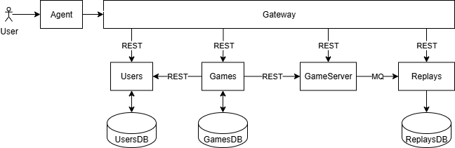

| User                | GameServer  | Games                    | Replays           | 
|---------------------|-------------|--------------------------|-------------------|
| POST /users/signup  | POST /start | GET /games               | GET /records/{id} |
| POST /users/signing |             | POST /games              | GET /records      |
| PATCH /users/{id}   |             | POST /games/{id}/request |                   |
| POST /users/verify  |             | POST /games/{id}/join    |                   |
|                     |             | GET /games/invitations   |                   |

## EndPoints
### User

POST /users/signup - регистрация   
POST /users/signing - авторизация  
PATCH /users/{id} - редактирование  
POST /users/verify - проверить jwt  

### Games

POST /games - создать игру  
GET /games -  получить список игр  
GET /games/invitations - посмотреть приглашения в игры  
POST /games/{id}/join - присоединиться к игре из приглашений  
POST /games/{id}/request - отправить приглашение в игру  

### GameServer

POST /start - Запустить игру  

### Replays

GET /records - получить список повторов игр  
GET /records/{id} - запустить повтор игры на просмотр  

## Узкие места и потенциальные проблемы масштабирования

| Сервис     | Проблема                                                                                                                     | Решение                                                                                                                                                                                                                                                                                                  |
|------------|------------------------------------------------------------------------------------------------------------------------------|----------------------------------------------------------------------------------------------------------------------------------------------------------------------------------------------------------------------------------------------------------------------------------------------------------|
| Users      | При каждом обращении игрока к gateway надо каждый раз запрашивать и провеять его jwt. Это создает лишнюю нагрузку на Users. | Сервис сохраняет ключи и использует их для проверки JWT пользователя.                                                                                                                                                                                                                                    | 
| GameServer | При нагрузке не должно быть задержек при обработке запросов.                                                                 | Использовать grpc вместо json.                                                                                                                                                                                                                                                                           |
| Games      | Перегрузка при наплыве игроков по вечерам в зависимости от локации.                                                          | Асинхронное взаимодействие с другими сервисами.   Исключение из сервиса любой логики, тормозящей обработку запросов (уменьшение количества обращений к БД в процессе работы)   Мониторинг нагрузки   Вертикальное масштабирование + профилирование и нагрузочное тестирование каждой сборки. | 
| Replays    | Сохранение записей происходит после каждой игры каждого пользователя - деградация скорости работы запросов при росте БД.     | Ограничение времени хранения реплеев. Шардирование.                                                                                                                                                                                                                                                      | 

## Компоненты, к которым чаще всего будут меняться требования
У всех сервисов при добавлении каких-то новых фичей будет автоматом усиляться требования к нагрузке.  
Ниже перечислены сервисы по количеству потенциальных изменений по убыванию. 

1 Games:
Новые игровые объекты/правила/игры.

2 GameServer:
Новые виды игр/турниров.

3 Replays:
Новые параметры просмотра реплеев.

4 Users
Сервис пользователей. 